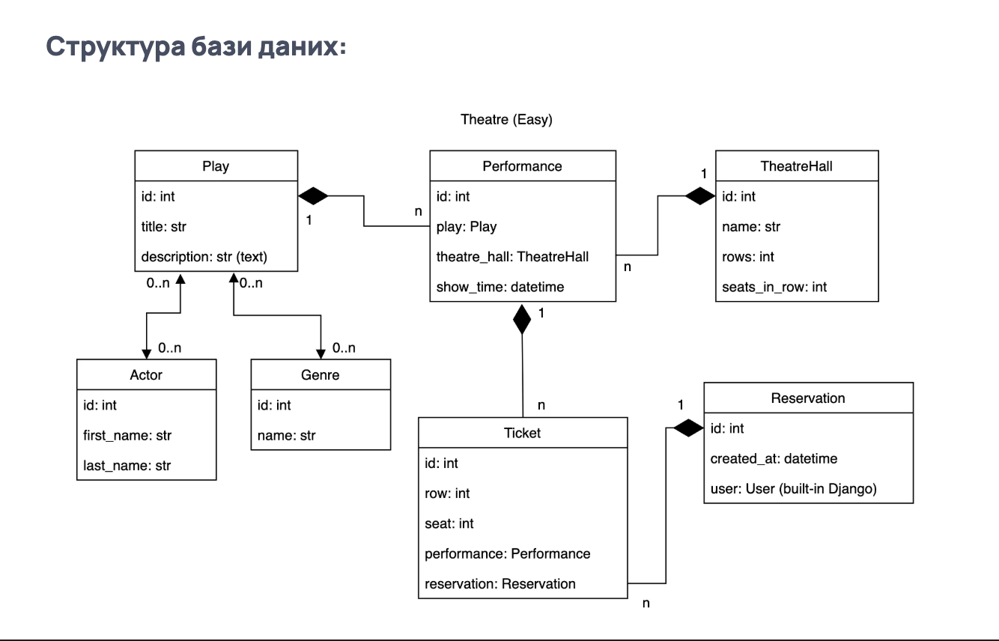

# Theatre API
> REST API for theatre plays, halls, tickets, and reservations

A Django + Django REST Framework project that provides endpoints for managing theatre plays, actors, genres, halls, performances, reservations, and tickets.  
Includes **JWT authentication** for secure access.

## Running locally

### 1. Clone the repository
```bash
git clone https://github.com/<your-username>/theatre-api.git
cd theatre-api
```

### 2. Create virtual environment

```bash
python -m venv venv
source venv/bin/activate   # Linux/Mac
venv\Scripts\activate 
```

### 3. Install dependencies

```bash
python -m venv venv
source venv/bin/activate   # Linux/Mac
venv\Scripts\activate 
```

### 4. Configure environment variables

Create a .env file in the project root with values:

DB_HOST=localhost
DB_NAME=theatre_db
DB_USER=postgres
DB_PASSWORD=yourpassword
SECRET_KEY=your-secret-key

### 5. Apply migrations

```bash
python manage.py migrate
```

### 6. Create superuser

```bash
python manage.py createsuperuser
```


### 7. Run server

```bash
python manage.py runserver
```

## Server will be available at:

API root → http://127.0.0.1:8000/api/
Admin panel → http://127.0.0.1:8000/admin/
Swagger docs → http://127.0.0.1:8000/api/docs/

## Demo Account

Login: user
Password: user1234

### Initial Configuration

Default database: SQLite
Production recommended: PostgreSQL (configure in settings.py)
Authentication: JWT (djangorestframework-simplejwt)

### Building

If using Docker:

```shell
docker-compose up --build
docker-compose up
```

## Features

Play — theatre plays with description and actors
Actor — actors in the theatre
Genre — genres of plays
TheatreHall — halls with rows and seats
Performance — scheduled shows of plays in halls
Reservation — reservations made by users
Ticket — tickets with assigned row and seat

## Configuration

DATABASES → SQLite by default, PostgreSQL for production
JWT → endpoints for tokens (api/token/, api/token/refresh/)
STATIC/MEDIA → configured in settings.py

## Running tests

All tests are written with pytest and run inside Docker.

Run all tests:
```bash
docker compose run theatre pytest theatre/tests/
```

## Contributing

If you’d like to contribute:
Fork the repository
Use a feature branch
Submit a Pull Request

## Links

Repository: https://github.com/ihor-seven/theatre-api
Django docs: https://docs.djangoproject.com/
DRF docs: https://www.django-rest-framework.org/

## DB Structure
